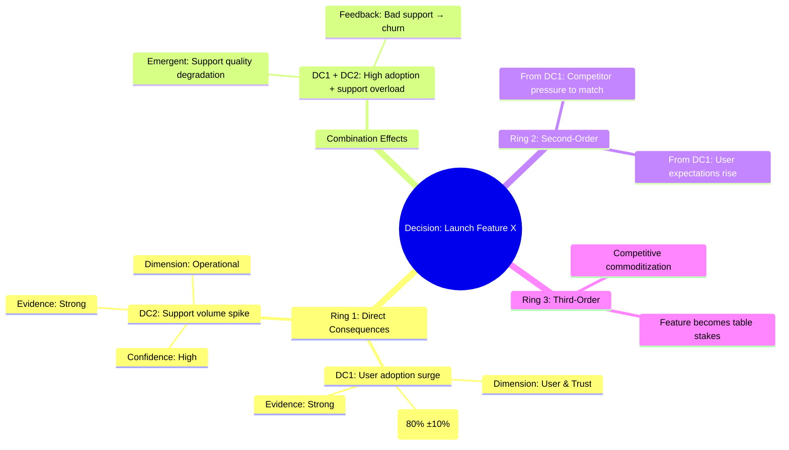

# AI-Powered Futures Wheel

Map the direct and indirect consequences of any decision, event, or trend — before you commit to it. The Futures Wheel is a structured brainstorming tool originally developed by Jerome C. Glenn that expands outward from a central decision through concentric rings of consequences.

This skill pairs the visual logic of the Futures Wheel with AI-driven analysis to surface the hidden impacts a standard pros/cons list will miss. It works as a **collaborative, step-by-step process** — the human stays in the driver's seat and can steer, challenge, or redirect the analysis at every stage.

> "A standard pros and cons list might not surface hidden impacts — like how a small tweak to your product's pricing could strain customer support or trigger unexpected PR issues."

The Futures Wheel is built for strategic leaders, product teams, and ethics-focused practitioners who need to anticipate unintended consequences before they happen. It's especially powerful when combined with other expertise lenses: running the same decision through an Ethicist mode + a Pessimist mode + a Regulator mode reveals far more than a single balanced analysis.

---

## Why Step-by-Step Matters

Futures thinking is inherently collaborative. If the AI dumps the entire wheel at once, the human loses the ability to shape it — and the analysis becomes a monologue instead of a conversation. Each step builds on the previous one, and the human's judgment at each stage makes the next stage better. The pauses aren't a formality; they're where the best insights happen.

The human's role is not passive. You're meant to redirect, challenge, add stakeholder perspectives, and course-correct the analysis as it unfolds.

---

## How the Futures Wheel Works

The wheel has four layers (three concentric rings plus combination effects):

**Ring 1 — Direct Consequences (First-Order)**
The immediate, obvious outcomes that most people already anticipate. What happens directly because of the decision? Include both positive and negative outcomes.

**Combination Effects**
What happens when two or more Ring 1 consequences collide? Randomly pair or group direct consequences and examine what emergent outcomes their interaction creates. This is where the Futures Wheel earns its keep — combination effects are the consequences that almost nobody anticipates because they require two things to be true simultaneously.

**Ring 2 — Indirect Consequences (Second-Order)**
All the new impacts that come from both individual Ring 1 consequences and their combinations. Highlight any particularly surprising or hidden impacts.

**Ring 3 — Systemic Consequences (Third-Order)**
What happens as a result of the second-order consequences? These represent the long arc of a decision playing out over time. Select only the most significant Ring 2 consequences to trace forward.

**Hidden Impacts**
Consequences that don't fit neatly into the ring structure but are important: ethical implications, effects on vulnerable or marginalized groups, second-victim effects (who is harmed indirectly), and low-probability/high-severity edge cases.

---

## Core Framework

### Analysis Dimensions

For each ring, assess consequences across these dimensions. Not every dimension applies to every decision — use judgment to focus on what's relevant.

| Dimension | What to Look For | Example |
|-----------|-----------------|---------|
| **Operational** | Team capacity, processes, support load, infrastructure, technical debt | A feature that's fast to build but creates ongoing support burden |
| **Financial** | Revenue, costs, pricing pressure, investor signals, market share | Lower prices increase volume but compress margins |
| **User & Trust** | User behavior changes, trust signals, churn risk, adoption friction | A privacy feature might prevent tracking but also blocks personalization |
| **Ethical** | Privacy, fairness, harm to vulnerable groups, manipulation risk, transparency | A frictionless onboarding might inadvertently capture minors' data |
| **Reputational** | PR risk, media framing, stakeholder perception, brand positioning | A cost-cutting measure becomes a story about abandoning users |
| **Competitive** | How competitors respond, market positioning shifts, moat erosion | Offering free trials forces competitors to do the same |
| **Regulatory** | Legal exposure, compliance burden, regulatory attention, precedent risk | A new data type triggers GDPR/CCPA review |
| **Cultural** | Team morale, norms, values alignment, retention signals | Remote-first decision signals trust but can isolate new employees |
| **Accessibility & Inclusion** | Impact on disabled users, neurodivergent users, non-native speakers, older adults | Auto-play video is convenient for most but blocks screenreader users |
| **Equity** | Disproportionate impact on underrepresented groups, economic inequality | Premium tier excludes lower-income users from features |

---

## Process

### Step 1: Subject Overview & Time Horizon Framing

Summarize the decision, event, or trend in 1–2 sentences so both sides are clear on what's being analyzed. Include the stated goal or motivation behind the decision if known.

**Establish time horizons** — clarify which timeframe to focus on:
- **30 days**: Immediate operational impact, user reaction
- **6 months**: Team adaptation, competitor response, user behavior shifts
- **2 years**: Market positioning, business model stress, regulatory changes
- **5 years**: Industry norms, long-term user relationship, second-victim effects

Longer horizons reveal systemic consequences; shorter horizons catch acute failures.

If the human hasn't specified an analyst mode, briefly mention the available modes and ask if they want a specific lens or the default balanced analysis.

**Then STOP.** Wait for confirmation.

### Step 2: Direct Consequences (Ring 1)

List 5–7 first-order consequences. Include both positive and negative outcomes.

For each consequence, assign:
- **Confidence:** A probability range (e.g., "70% ±10%") plus a qualitative label (High / Medium / Low)
- **Evidence level:** Strong (data/precedent), Moderate (reasonable inference), or Speculative (plausible but unproven)
- **Primary dimension affected:** Which area this hits hardest
- **Time to impact:** When this consequence becomes visible (immediate, weeks, months)

Note any obvious gaps — dimensions not represented, stakeholders missing, or consequences that feel too safe.

**Then STOP.** Wait for modification.

### Step 3: Combination Effects

Take confirmed Ring 1 consequences and pair them to surface emergent outcomes:

1. Select 3–5 pairings of Ring 1 consequences. Prioritize unexpected combinations.
2. Describe the emergent outcome and assign confidence.
3. Flag combinations that create feedback loops.
4. Identify amplification scenarios — does this make consequences worse?

**Example**: Pricing change + competitor first-mover advantage = market perception you're copying, not leading.

**Then STOP.** Wait for review.

### Step 4: Indirect Consequences (Ring 2)

For each confirmed Ring 1 consequence and combination effect, list 2–3 indirect consequences.

Highlight:
- **Surprising** — not obvious extension of first-order effect
- **Cross-dimensional** — operational consequence creates ethical problem, etc.
- **Irreversible** — difficult or impossible to undo
- **Disproportionate** — affects some groups more severely

**Then STOP.** Wait for review.

### Step 5: Systemic Consequences (Ring 3) & Hidden Impacts

Select 3–5 most significant Ring 2 consequences and trace third-order effects.

Then surface **Hidden Impacts**:

**Ethical & Equity**
Who might be harmed? Vulnerable or marginalized groups? Accessibility, inequality, power asymmetries?

**Low-Probability / High-Severity Tail Risks**
What's the tail risk — unlikely but catastrophic?

**Second-Victim Effects**
Who is affected by effects on others, not directly by the decision?

**Regulatory & Legal Landmines**
Compliance implications not caught in standard legal review?

**Then STOP.** Wait for review.

### Step 6: Decision Quality Score & Kill Criteria

Evaluate the **decision quality** holistically.

**Decision Quality Score** (1-10):
- **9-10**: Low risk, high clarity, safeguards in place
- **7-8**: Acceptable risk, mitigations feasible
- **5-6**: Moderate risk, careful execution needed
- **3-4**: High risk, significant unknowns
- **1-2**: Critical issues; reconsider

**Kill Criteria** — Consequence patterns that should stop this decision:
- **Irreversible harm to vulnerable populations**: If consequence harms protected group and can't be mitigated
- **Regulatory violation**: Material breach of compliance
- **Breach of core values**: Contradicts stated mission or values
- **Systemic dependency on uncertain assumptions**: Ring 3 depends on what you can't control
- **Uncorrectable reputation/trust damage**: Once triggered, can't be reversed

State clearly: **"This decision should not proceed unless [specific condition] is met."**

**Then STOP.** Wait for final review.

### Step 7: Summary & Next Steps

Provide:

1. **Three Most Important Consequences** — across any ring — most likely to be missed

2. **Decision Recommendation** — Should this proceed? What needs to change?

3. **Mitigations & Safeguards** — For each significant consequence:
   - Preventative: Changes to decision itself
   - Protective: Monitoring systems, circuit breakers, fallback plans
   - Responsive: Detection and rapid response protocols

4. **Monitoring Plan** — What signals indicate predicted consequences? How will you pivot?

5. **Optional: Light Wheel** — Most significant positive consequences; upside scenarios to design toward

Wait for final feedback.

---

## AI Analyst Modes

Ask which mode the human prefers, or default to balanced Futurist:

- **Futurist** — Balanced analysis, bias toward identifying hidden impacts
- **Pessimist** — What could go wrong, edge cases, worst-case scenarios
- **Optimist** — Upside scenarios, compounding positive effects, best-case execution
- **Ethicist** — Harm to vulnerable populations, fairness, unintended discrimination
- **Regulator** — Legal and compliance implications, precedent risk, enforcement
- **Competitor** — How would competitors exploit or respond? What advantage gained?
- **Accessibility Advocate** — Impact on disabled users, neurodivergent users, older adults
- **Economist** — Market dynamics, pricing signals, equilibrium shifts, behavioral responses
- **Domain Expert** — Specific expert POV (physician, educator, technologist, etc.)

**Multiple modes combined** produce richer analysis. Optimist + Pessimist + Ethicist reveals far more than single lens.

---

## Industry-Specific Consequence Templates

### SaaS / Subscription

**Likely Ring 1**: Churn impact, competitor response, support load, feature parity pressure, revenue volatility

**Likely combinations**: Pricing change + competitor undercut + support volume = revenue collapse

**Ring 3 signals**: Market concentration, winner-take-most dynamics, retention becomes paramount

**Kill criteria**: Decisions making retention harder without proportional value increase

### E-Commerce

**Likely Ring 1**: Conversion impact, basket size, fraud risk, shipping cost pressure, review/reputation

**Likely combinations**: Free shipping + lower margins + volume surge = operational strain + service issues + reputation damage

**Ring 3 signals**: Margin compression forces different business model

**Kill criteria**: Decisions degrading user experience to save costs often backfire

### Healthcare / Biotech

**Likely Ring 1**: Patient outcome impact, regulatory scrutiny, liability, trust, clinical trial implications

**Likely combinations**: Speed-to-market + insufficient safety data = regulatory rejection + trust damage

**Ring 3**: Regulatory landscape shifts, insurance decisions, liability precedents

**Kill criteria**: Any decision putting patient safety at risk or violating informed consent

### Fintech / Financial Services

**Likely Ring 1**: Compliance burden, fraud/AML, competitive response, user friction, regulatory attention

**Likely combinations**: New feature + compliance gap + enforcement = business disruption + brand damage

**Ring 3**: Regulatory tightening, enforcement becomes standard

**Kill criteria**: Decisions creating compliance risk or enabling fraud

### Social Media / Content Platforms

**Likely Ring 1**: Creator retention, user behavior shift, content moderation load, advertiser concerns

**Likely combinations**: Algorithm change + creator revenue impact + exodus = network effects collapse

**Ring 3**: Network effects flip as creators leave

**Kill criteria**: Decisions harming creators without equivalent user value trigger exodus

---

## Adapting the Analysis

**Change the actor:** Re-run from perspective of specific stakeholder (vulnerable user, competitor, regulator, journalist, frontline employee)

**Shift the time horizon:** Re-run for different timeframe to see how consequences compound

**Deep dive:** Run full sub-wheel on significant consequence as new central event

**Add a lens:** Re-run through Ethicist or Pessimist lens to surface different concerns

**Change output format:** Request Mermaid diagram for documentation, risk matrix for stakeholder communication, or mitigation plan for implementation

---

## Reference Guide

### Mermaid Diagram Export

### Risk Matrix

| Impact \ Likelihood | Low | High |
|---|---|---|
| **High** | Monitor | **CRITICAL — Kill Criteria?** |
| **Low** | Accept | Mitigate |

---

## Cross-References

Pairs well with:
- **black-mirror-auditor**: Stress-test significant consequences further
- **accessibility-advisor**: Ensure accessibility/equity dimensions weighted appropriately; communicate business case
- **ai-transparency-auditor**: If decision involves AI/ML, audit transparency and explainability consequences
- **design-review-cowork**: If design change, use wheel to map consequences first, then validate design

---

## Grounded In

Builds on Jerome C. Glenn's original Futures Wheel and extends with:

- Probabilistic confidence ranges for each consequence
- Evidence level ratings to separate grounded analysis from speculation
- Combination effects surfacing emergent outcomes
- Decision Quality Scoring for holistic risk/reward evaluation
- Kill Criteria identifying hard stops
- Time-horizon framing for acute vs. systemic impacts
- Industry-specific templates highlighting domain-relevant consequences
- AI as collaborative second brain, not list generator
- Explicit sections for ethical, equity, and accessibility consequences
- Step-by-step collaborative process where human judgment shapes each stage

**The goal is not to predict the future. It is to expand the range of futures you've considered before you commit.**
